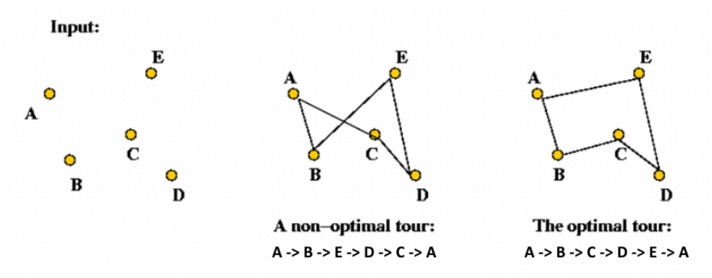
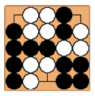
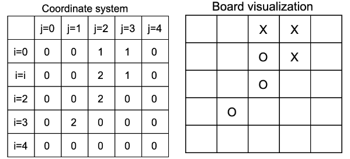
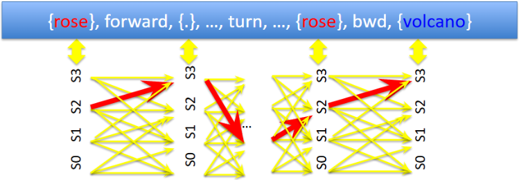
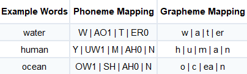

# AI Projects

Copy of AI project code in private repos.
Please request the source code for the associated projects at rahulpuranam@gmail.com

## Project 1: Path-Finding Algorithms and Genetic Algorithm

This project implements a **Genetic Algorithm** to solve a **3D Traveling Salesman Problem** (TSP), where the goal is to find the shortest possible route that visits a set of 3D coordinates exactly once and returns to the starting point. The solution optimizes path distance using evolutionary techniques such as population initialization, parent selection, crossover, and fitness evaluation.
 

 

Key Components:
- **Genetic Algorithm** for heuristic optimization
- 3D Euclidean distance calculations
- Input/Output: Reads coordinates from input.txt and writes the optimal path to output.txt

For implementation details and constraints, refer to the assignment PDF.

## Project 2: Little-Go Agent

This project involves developing an AI agent to play Little-Go, a simplified 5x5 version of the board game Go. The agent must adhere to the game's rules (e.g., liberty, KO, no-suicide) and compete against other AI opponents, ranging from basic (random, greedy) to advanced (alpha-beta, Q-learning).
 

 

Key Components:
- Game Rules: Liberty (no-suicide), KO, area scoring, and komi (2.5 points for White)
- Agent Implementation: Utilized alpha-beta pruning with minimax for optimal decision-making
- Input/Output: Reads board states from input.txt and outputs moves to output.txt (e.g., 2,3 or PASS)

For implementation details and constraints, refer to the assignment PDF.

## Project 3: Little Prince and Viterbi Algorithm

This project focuses on temporal reasoning using Partially Observable Markov Decision Processes (POMDPs) to solve two problems:

- The Little Prince: Predict the most likely sequence of hidden states given actions and observations (e.g., ["rose", "forward", "none"] → ["S2", "S3"])
 

 

- Speech Recognition: Map phonemes (spoken sounds) to graphemes (written symbols) using POMDPs (e.g., ["W", "AO1"] → ["w", "a"])
 

 

Key Components:
- Parse input files (state_weights.txt, state_action_state_weights.txt, etc.) to construct probability tables
- Implement the Viterbi algorithm to infer the optimal hidden state sequence
- Output results in the specified format to states.txt

For implementation details and constraints, refer to the assignment PDF.