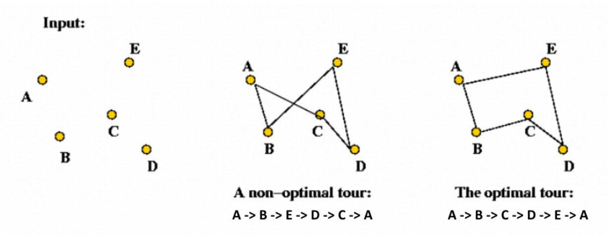
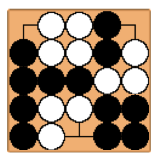
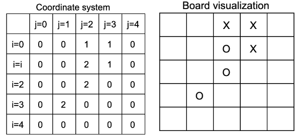
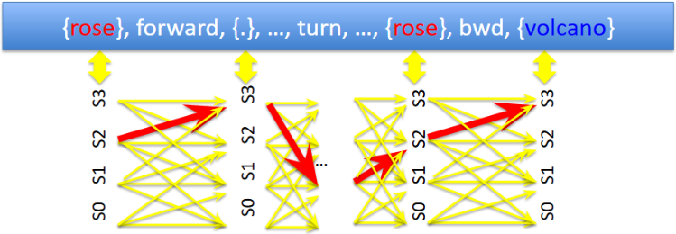
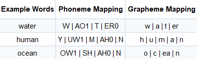

# AI Projects

Copy of AI project codes from private repos.

Please request the source code for the associated projects at rahulpuranam@gmail.com

## Project 1: Path-Finding Algorithms and Genetic Algorithm

This project implements a **Genetic Algorithm** to solve a **3D Traveling Salesman Problem** (TSP), where the goal is to find the shortest possible route that visits a set of 3D coordinates exactly once and returns to the starting point. The solution optimizes path distance using evolutionary techniques such as population initialization, parent selection, crossover, and fitness evaluation.
 

 

Key Components:
- **Genetic Algorithm** for heuristic optimization
- 3D Euclidean distance calculations
- Input/Output: Reads coordinates from input.txt and writes the optimal path to output.txt

For implementation details and constraints, refer to the assignment PDF in `1-GeneticAlgo`.

## Project 2: Little-Go Agent

This project involves developing an AI agent to play Little-Go, a simplified 5x5 version of the board game Go. The agent must adhere to the game's rules (e.g., liberty, KO, no-suicide) and compete against other AI opponents, ranging from basic (random, greedy) to advanced (alpha-beta, Q-learning).
 

 

Key Components:
- Game Rules: Liberty (no-suicide), KO, area scoring, and komi (2.5 points for White)
- Agent Implementation: Utilized alpha-beta pruning with minimax for optimal decision-making
- Input/Output: Reads board states from input.txt and outputs moves to output.txt (e.g., 2,3 or PASS)

For implementation details and constraints, refer to the assignment PDF in `2-AIGo`.

Test out this agent at https://hyperburn777.github.io/go.html

## Project 3: Little Prince and Viterbi Algorithm

This project focuses on temporal reasoning using Partially Observable Markov Decision Processes (POMDPs) to solve two problems:

- The Little Prince: Predict the most likely sequence of hidden states given actions and observations (e.g., ["rose", "forward", "none"] → ["S2", "S3"])
 

 

- Speech Recognition: Map phonemes (spoken sounds) to graphemes (written symbols) using POMDPs (e.g., ["W", "AO1"] → ["w", "a"])
 

 

Key Components:
- Parse input files (state_weights.txt, state_action_state_weights.txt, etc.) to construct probability tables
- Implement the Viterbi algorithm to infer the optimal hidden state sequence
- Output results in the specified format to states.txt

For implementation details and constraints, refer to the assignment PDF in `3-LittlePrince`.

## Project 4: Iris Dataset Classification

This project explores classic machine learning techniques using the famous Iris dataset. The goal is to classify iris flowers into three species (setosa, versicolor, virginica) based on four features: sepal length, sepal width, petal length, and petal width.
 
<!-- No image available for this project -->
 

Key Components:
- Data Preprocessing: Reads and processes the Iris dataset from CSV files
- Feature Engineering: Extracts and normalizes relevant features
- Classification: Implements algorithms such as k-Nearest Neighbors (k-NN) and/or Decision Trees for species prediction
- Evaluation: Measures model accuracy and performance on test data

For implementation details and constraints, refer to the code in `4-Iris/iris.py` and the provided data files.

## Project 5: CobotOps - Collaborative Robot Operations

This project analyzes and optimizes collaborative robot (cobot) operations using real-world datasets. The focus is on extracting actionable insights from cobot activity logs and improving operational efficiency.
 
<!-- No image available for this project -->
 

Key Components:
- Data Analysis: Loads and processes cobot operation data from Excel files
- Feature Extraction: Identifies key metrics and operational patterns
- Visualization: Generates plots and summaries to highlight trends and anomalies
- Optimization: Suggests improvements or automates aspects of cobot workflows

For implementation details and constraints, refer to the code in `5-CobotOps/cobotops.py` and the dataset in `5-CobotOps/data/`.

## Project 6: AP News Scraper & Sentiment Analyzer

This project implements a comprehensive news analysis system that scrapes top stories from AP News and performs advanced sentiment analysis. The system combines web scraping capabilities with natural language processing to extract insights from current news content.
 
<!-- No image available for this project -->
 

Key Components:
- **News Scraping**: Automated extraction of headlines, summaries, and full article text from AP News
- **Multi-method Sentiment Analysis**: Uses both VADER and TextBlob for comprehensive sentiment scoring
- **Entity Recognition**: Dynamically identifies organizations, industries, and locations mentioned in articles
- **Industry Classification**: Categorizes content by industry (healthcare, technology, finance, media, etc.)
- **Keyword Analysis**: Extracts positive and negative keywords that influence sentiment scores
- **Data Storage**: Saves results in both JSON format and individual text files for detailed analysis

For implementation details and constraints, refer to the code in `6-News/scraper.py`, `6-News/analyzer.py`, and the documentation in `6-News/README.md`.
